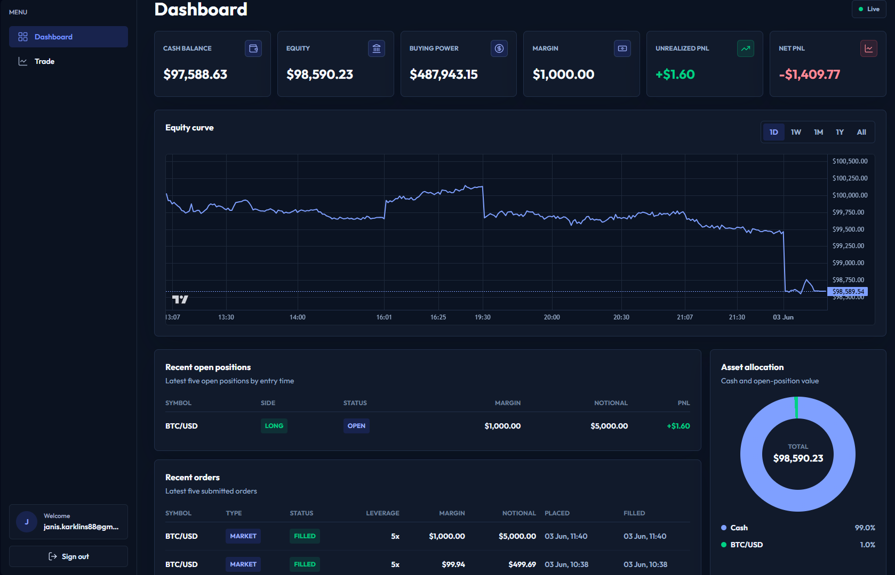
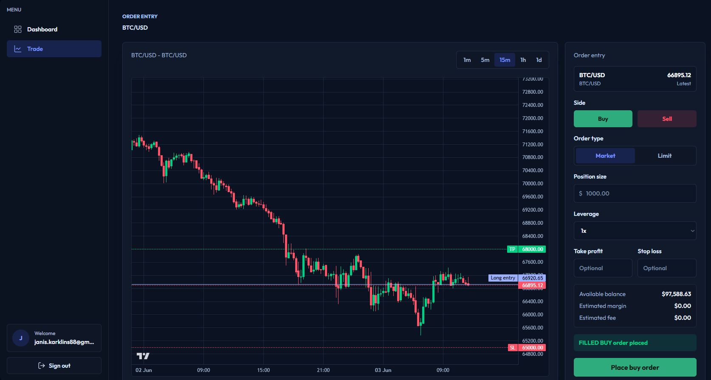
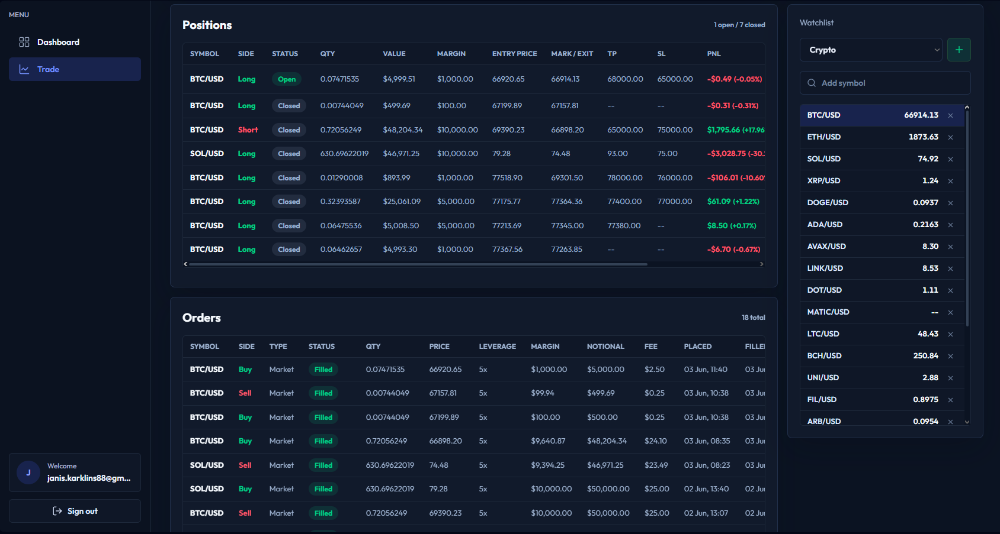

# Paper Trading Dashboard

A full-stack paper trading application for placing simulated trades, tracking open positions, and monitoring account performance with live market updates.

The project uses a Spring Boot backend with PostgreSQL persistence and a React/Vite frontend. Market data and symbol metadata are fetched from Alpaca, while account, order, position, and price updates are pushed to the UI through WebSocket/STOMP topics.

## Screenshots

### Dashboard



### Trading Chart



### Positions and Orders



## Features

- User registration, login, and JWT-protected API access
- Trading account summary with cash, equity, margin, buying power, unrealized PnL, and net PnL
- Market and limit order placement
- Open position tracking with live mark-to-market PnL
- Position close flow with account cash/margin updates
- Order history, status updates, and execution toasts
- Watchlists and searchable symbols
- Candlestick chart with configurable default zoom per timeframe
- Dashboard with account cards, equity curve, recent positions, recent orders, and asset allocation
- Equity snapshots for dashboard performance chart timeframes: 1D, 1W, 1M, 1Y, and All

## Tech Stack

Backend:

- Java 21
- Spring Boot 3
- Spring Security + JWT
- Spring Data JPA
- Flyway
- PostgreSQL
- WebSocket/STOMP
- Maven

Frontend:

- React 19
- TypeScript
- Vite
- Tailwind CSS
- lightweight-charts

External services:

- Alpaca Market Data API
- Alpaca Paper Trading API for asset metadata

## Project Structure

```text
.
+-- src/main/java/com/jk/paper_trading_dashboard
|   +-- account
|   +-- alpaca
|   +-- marketdata
|   +-- order
|   +-- position
|   +-- shared
|   +-- user
|   +-- watchlist
+-- src/main/resources/db/migration
+-- frontend/src
|   +-- features
|   +-- pages
|   +-- utils
+-- compose.yaml
+-- pom.xml
```

## Prerequisites

- Java 21
- Node.js and npm
- Docker, for local PostgreSQL
- Alpaca API key and secret

## Configuration

The backend reads local defaults from `src/main/resources/application.properties`.

For local secrets, create `src/main/resources/application-local.properties`. This file is ignored by git.

Example:

```properties
alpaca.api-key=your_alpaca_key
alpaca.secret-key=your_alpaca_secret
alpaca.base-url=https://data.alpaca.markets
alpaca.trading-base-url=https://paper-api.alpaca.markets
app.jwt.secret=replace-with-a-long-local-secret-at-least-32-bytes
```

You can also use environment variables:

```text
ALPACA_API_KEY
ALPACA_SECRET_KEY
ALPACA_MARKET_DATA_BASE_URL
ALPACA_TRADING_BASE_URL
JWT_SECRET
```

## Running Locally

Start PostgreSQL:

```powershell
docker compose up -d
```

Run the backend:

```powershell
.\mvnw.cmd spring-boot:run
```

Run the frontend:

```powershell
cd frontend
npm install
npm run dev
```

The frontend runs on Vite, usually at:

```text
http://localhost:5173
```

Vite proxies:

- `/api/*` to `http://localhost:8080`
- `/ws-native` to `ws://localhost:8080`

## Verification

Backend tests:

```powershell
.\mvnw.cmd test
```

Frontend build:

```powershell
cd frontend
npm run build
```

## API Areas

Main REST areas:

- `/users` - registration, login, current user
- `/trading-account` - account summary, reset, equity curve
- `/market-data` - latest prices, bulk prices, candles, active symbol tracking
- `/symbols` - searchable tradeable symbols
- `/watchlists` - watchlist management
- `/orders` - order placement, history, cancellation
- `/positions` - open positions and close flow

Main WebSocket topics:

- `/topic/prices/{symbol}`
- `/topic/orders/{userId}`
- `/topic/positions/{userId}`
- `/topic/portfolio/{userId}`

## Market Data Notes

Candles are requested from Alpaca with a backend limit of 1000 bars per request. The chart does not display every loaded candle by default; each timeframe has its own visible-window setting in:

```text
frontend/src/features/trade/components/TradingChart.tsx
```

The chart forms the latest candle from live price updates and periodically refreshes historical candles to reconcile with provider data.

## Database

Schema changes are managed by Flyway migrations in:

```text
src/main/resources/db/migration
```

Hibernate is configured with `ddl-auto=validate`, so migrations must match the JPA model before the backend starts successfully.
